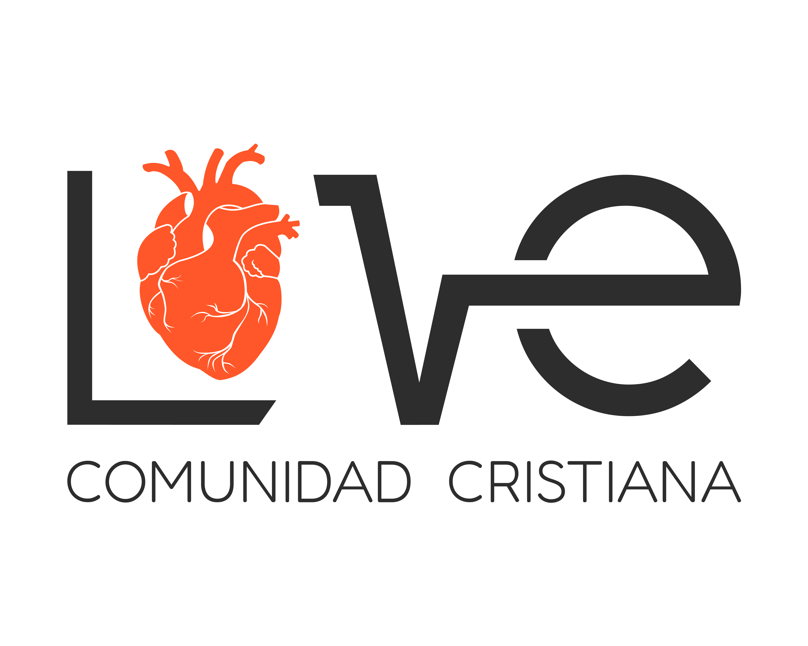
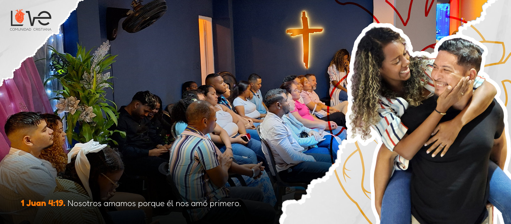

# Comunidad Love - Cartagena

<p align="center">
  
</p>

<p align="center">
  <strong>Un lugar para amar y ser amado</strong>
</p>

---

## 📖 Sobre Comunidad Love

**Comunidad Love** es una congregación cristiana ubicada en la hermosa e histórica ciudad de Cartagena de Indias, Colombia. Fundada en el año 2018 con el propósito firme de levantar una gran familia de fe, la iglesia se enfoca en restaurar hogares, consolidar familias y servir activamente a la comunidad local a través de los valores del evangelio, la solidaridad y la excelencia.

<p align="center">
  
</p>

---

## 🏛️ Estructura del Proyecto

El repositorio está organizado de la siguiente manera:
*   `ComunidadLoveWeb/`: Contiene el código fuente completo del sitio web público de la iglesia.
    *   `index.html`: Estructura principal enriquecida con metatags SEO y enlaces CDN optimizados.
    *   `style.css`: Estilos visuales personalizados (colores HSL, transiciones fluidas, diseño móvil cajón/drawer, efectos de vidrio esmerilado y animaciones de latido).
    *   `app.js`: Lógica interactiva en JavaScript (pestañas de mapa/video, reproductor simulado, muro de oraciones con LocalStorage, calendario determinista y Intersection Observer).
    *   `Assets/`: Biblioteca de recursos multimedia organizada por ministerios (Kids, Adora, Merchandising, Perfil).
    *   `favicon.png`: Icono personalizado de pestaña del navegador.
*   `LoveCrud/`: Espacio reservado para el módulo de administración y gestión interna.

---

## 🎨 Características Destacadas de la Web

### 📹 Integración de Video Activa
El sitio incluye reproductores interactivos incrustados directamente de las redes oficiales:
*   **Reuniones dominicales**: Frame responsivo de YouTube que reproduce el último mensaje o servicio dominical.
*   **¿Cómo llegar?**: Pestaña dedicada en la sección "Nosotros" que carga el video vertical (Reel de Instagram) con la ruta de acceso a la iglesia.

### 💖 Identidad Visual y Latidos
*   **Logotipos de perfil**: Integración de los imagotipos de corazón (`Perfil-IG.jpg` y `Perfil-whatsapp.jpg`) latiendo mediante la animación `@keyframes heartPulse` en CSS, sirviendo como separadores innovadores y dinámicos para todas las secciones.
*   **Scroll Reveal**: Cada módulo del sitio web realiza una animación elegante de desvanecido, desenfoque y desplazamiento ascendente al entrar en el campo de visión del usuario.

### 📋 Muro de Clamor (Peticiones)
Un sistema de peticiones de oración interactivo que utiliza el almacenamiento local del navegador (`LocalStorage`) para que los usuarios puedan enviar sus mensajes de clamor y unirse en oración con otros en tiempo real.

---

## 👥 Familia Pastoral

La iglesia está liderada por los pastores principales **James y Zuleima Andrade**, quienes junto a sus hijos Aaron, Aitana y Ariadna Andrade Ruiz guían a la congregación con amor y visión de restauración comunitaria.

<p align="center">
  
</p>

---

## ⛪ Ministerios Principales

| Ministerio | Enfoque | Recurso Visual |
| :--- | :--- | :--- |
| **Love Kids** | Formación bíblica y recreativa para niños de 2 a 11 años. | [Logo Love Kids](./ComunidadLoveWeb/Assets/LOVE%20-%20KIDS/logo-love-kids.png) |
| **Love Woman** | Círculos de consejería, congresos y apoyo a la mujer virtuosa. | [Banner Love Woman](./ComunidadLoveWeb/Assets/LoveWoman.png) |
| **Love Adora** | Alabanza musical y preparación espiritual del servicio dominical. | [Imagen Adoración](./ComunidadLoveWeb/Assets/Love%20adora/love%20adora%20(1).jpg) |
| **Love Buenas Nuevas** | Evangelismo, visitas a hospitales, cárceles y acción social en Cartagena. | [Labor Social](./ComunidadLoveWeb/Assets/somos%20comunidad love/love%20comunidad%20(6).jpeg) |

---

## ⚙️ Tecnologías Utilizadas

*   **HTML5** y **CSS3** (Estilos fluidos, Flexbox, CSS Grid y Keyframes).
*   **JavaScript (Vanilla JS)** para el dinamismo de la interfaz.
*   **Leaflet.js** & **OpenStreetMap** para el mapa interactivo de ubicación.
*   **FontAwesome 6.4.0** para la biblioteca de iconos.

---

## 🚀 Cómo Ejecutar el Proyecto Localmente

1.  Clona el repositorio:
    ```bash
    git clone https://github.com/ChrisEna07/ComunidadLove.git
    ```
2.  Accede a la carpeta del sitio web:
    ```bash
    cd ComunidadLove/ComunidadLoveWeb
    ```
3.  Abre el archivo `index.html` en tu navegador.
    > [!TIP]
    > Para una experiencia óptima y sin restricciones de seguridad del protocolo de archivos local (`file://`), se recomienda iniciar un servidor local simple:
    > *   Si tienes Python instalado: `python -m http.server 8000`
    > *   Si usas Node.js: `npx serve`
